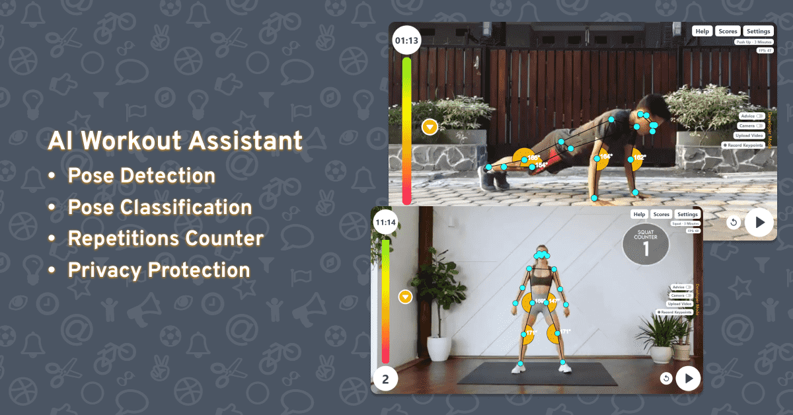
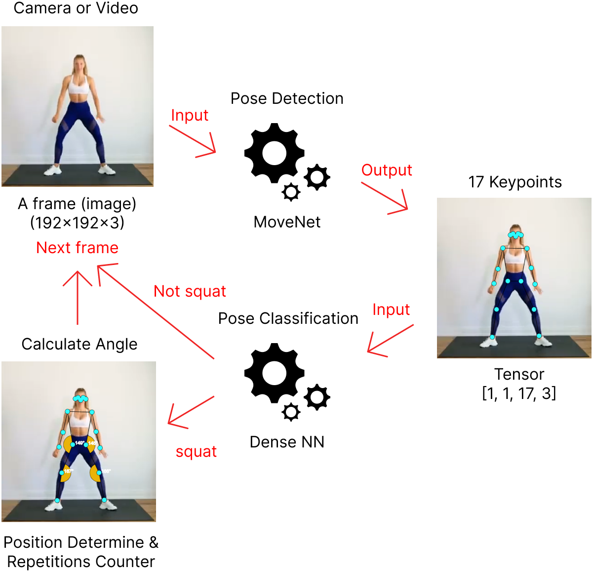

# AI Workout Assistant
An web application to help everyone do workout wherever and whenever. Supported by the pose detector feature to analyze every pose and auto count the number of repetitions made. So, let's create a healthy life by do workout every day!



Pose Detector and Classification in the AI Workout Assistant application fully runs on the Client side, so no image data comes out of the user's device. Videos or images processed by the program will be automatically deleted.
## How it Work
Image data which is obtained from video or webcam will be processed by pose detector using the MoveNet model to generate keypoints. Keypoints are used for repetition calculations and input for classifying workout types with Dense Neural Network (DNN) model.



## How to Run Locally
- Prerequisites: you'll need to have [Git](https://git-scm.com/), [Node](https://nodejs.org/), and [NPM](https://www.npmjs.com/package/npm) installed and running on your machine.
- Open terminal/powershell/command prompt then clone this repository  
    ```Bash
    git clone https://github.com/reevald/ai-workout-assistant.git
    cd ai-workout-assistant
    ```
- Install dependencies
    ```Bash
    npm install
    ```
- Once the installation is done, you can run the app locally
    ```Bash
    npm run start-dev
    ```
- Then open http://localhost:8080 to see your app.

## Generate Your Own Workout
1) Open app locally or visit [aiworkout.live](https://aiworkout.live/)
2) Collect dataset (keypoints):  
    - Using webcam (open settings menu => turn on `Developer Mode` => click `Record Keypoints` button then click again when finish recording)  
    **Note:** (1) The app only records keypoints while its playing and the result will be csv format; (2) The value of each keypoint always in resolution 640x360 (when use webcam only).
    - Via upload video (open settings menu => turn on `Developer Mode` => click `Upload Video`)  
    **Note:** (1) The value of each keypoint will be dependence with resolution of video; (2) High resolution of video will be reduce fps; (3) You can switch video to webcam (or vice-versa) while recording (not recommended can cause different resolution of keypoints).
3) Generate new model and train as well  
    The model is binary classification to determine workout or not. Example: push-up (positive) or not push-up (negative). In the step 2 above, we have been collect positive class. For negative class, you can use this [video](https://www.youtube.com/watch?v=jJCd3sOuO2M) as negative class data (convert first to get keypoints with step 2 above). Then after collect positive and negative data, open this [colab](https://colab.research.google.com/drive/1t1t0H6xKit5uup7hFLOqGxD9cbPVcMxv?usp=sharing) and follow the instruction. You will be get the model with tfjs format which will be use on the next step.  
    **Note:** to continue next step you need to run app locally (check `How to Run` above)
4) Put the model into the app  
    First create new folder ./public/tfjs-model/your-workout then move tfjs model and bin file into the new folder.
5) Create new configuration
    - Change file: ./public/mock-data/workout.json  
        ```Json
        "nameWorkout": ["Push Up", "Squat", "Your Workout"],
        "slugWorkout": ["push-up", "squat", "your-workout"],
        "duration": ["1 Minutes", "3 Minutes", "5 Minutes", "7 Minutes"]
        ```
        **Note:**  
        - `nameWorkout`: replace `Your Workout` with your workout name.
        - For `slugWorkout` part `your-workout` must match with model folder name.
        - You can change the `duration` in minutes.
    - Create new file: ./public/rules/your-workout.json with config like this  
        **Important**: Please using ./public/rules/push-up.json as reference
        ```Json
        {
            "poseDetectorConfig": {
                "model": "MoveNet",
                "detectorConfig": {},
                "estimationConfig": {}
            }
        }
        ```
        **Note :**
        - `Model` : `MoveNet` or `PoseNet`. For `BlazePose` not able to implement yet as it has 33 keypoints different with MoveNet or PoseNet 17 keypoints. (Ref: https://github.com/tensorflow/tfjs-models/tree/master/pose-detection).
        - `detectorConfig` (ref: https://github.com/tensorflow/tfjs-models/tree/master/pose-detection/src/movenet) using default configuration. If you want to change this, currently the only way is change directly in related file (./src/handlers/poseHandler.js).
        - `estimationConfig` is like `detectorConfig` as well (check ref above).
        
        ```Json
        {
            "classifierConfig": {
                "path": "./tfjs-model/your-workout/model.json",
                "label": ["Other", "Your Workout"]
            }
        }
        ```
        **Note:**  
        - `path`: change with your model path
        - `label`: must ordered by alphabet
        ```Json
        {
            "rulesCountConfig": {
                "nameWorkout": "Your Workout",
                "nameStage": ["Down", "Up"],
                "pathImageStage": ["./img/iconmonstr-caret-down-circle-filled-64.png", "./img/iconmonstr-caret-up-circle-filled-64.png"],
                "pathAudioStage": ["./audio/go-down-from-google-translate.webm", "./audio/go-up-from-google-translate.webm"],
                "anglePoint": {
                    "7": {
                        "spouseIdx": [9, 5],
                        "rangeAngle": [
                            { "min": 0, "max": 90 },
                            { "min": 150, "max": 180 }
                        ]
                    }
                }
            }
        }
        ```
        **Note**  
        - `nameWorkout`: replace `Your Workout` with your workout name.
        - `nameStage`: for example in push-up there are two stages Down and Up. The order is important, if start with Down, then 1 repetition equal to Down->Up.
        - `pathImageStage`: `path-image` (put first into ./public/img folder) or `url-image` (outside source)
        - `pathAudioStage`: prefer using webm format and it has short duration < 2 seconds. `path-audio` (put first into ./public/audio folder) or `url-audio` (outside source).
        - `anglePoint`: for example index keypoint 7 has spouse index keypoint 9 and 5. `rangeAngle` is range to each stage, ex: Down stage has range angle between 0 and 90 degree. To help determine index keypoints, please look at image below:
          
        Source image: (https://github.com/tensorflow/tfjs-models/tree/master/pose-detection)
6) Run the app to testing
    ```Bash
    npm run start-dev
    ```
    Then open http://localhost:8080 to see your own workout and have fun!

## Limitations
- Cannot cover 3D angle yet
    - Planning: research lightweight model that can generate 3D keypoints like BlazePose, MoVNect, LHPE-nets or [other model](https://paperswithcode.com/task/3d-human-pose-estimation).
- Currently the high resolution makes fps slower
    - You can try upload videos with high and low resolution then compare them and watch the fps.
    - Solution to webcam used: using limit with fixed "real" resolution 640x360. To display variate resolution screen, in this case we are using css manipulation.

## References
- Pose Detection with TFJS (https://github.com/tensorflow/tfjs-models/tree/master/pose-detection)
- MoveNet Documentation (https://github.com/tensorflow/tfjs-models/tree/master/pose-detection/src/movenet)
- MoveNet in TFHub (https://tfhub.dev/google/tfjs-model/movenet/singlepose/lightning/4)
- Pose Classification (https://developers.google.com/ml-kit/vision/pose-detection/classifying-poses)
- Original video (in image above)
    -   Man push-up (https://www.youtube.com/watch?v=OKn_6Me96Yc)
    -   Woman squating (1) (https://www.youtube.com/watch?v=LSj280OEKUI)
    -   Woman squating (2) (https://www.youtube.com/watch?v=QifjltKUMCk)

## TODOs
- Write documentations
- Write unit test
- [Done] Add audio effect (timer and movement direction)
- Data Augmentation (flip horizontal, scale, shear and shift) to try improve metric pose classification model (accuration)
- Convert to components (prefer using framework like react js)